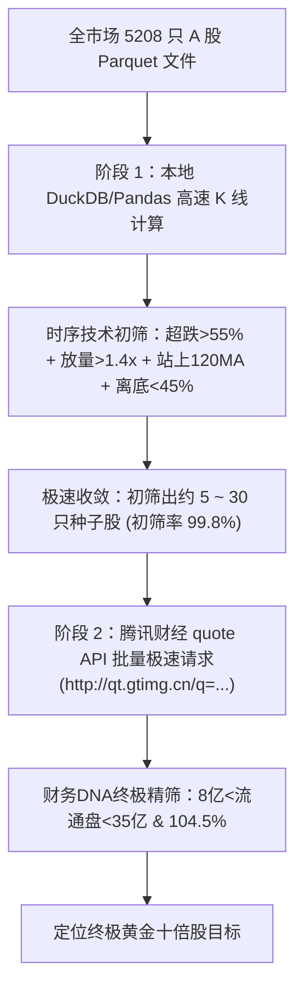

# 💎 基本面 DNA + 量价共振突破：下一代“十倍股”混合动力筛查策略设计规范书

本策略规范书详尽阐述了“基本面 DNA 核心护城河估值安全垫”与“技术超跌 + 哨兵资金量价突破”深度交织的下一代 A 股“十倍股”智能筛查系统设计。

---

## 📈 1. 策略哲学：为什么传统的“偏科筛选”极易爆雷？

在 A 股量化实战中，传统的单一模型筛选存在极大的局限性：
1.  **纯技术面筛选（极易买入价值陷阱/ST股）**：
    纯技术面（如只看超跌、均线突破和成交量放大）无法分辨企业的经营优劣。在极端情况下，系统会将面临重组退市的 **\*ST 股**、出现大额亏损的**垃圾股**，或者市值数百亿难以拉升的**大盘停滞巨头**当成“小市值弹性黑马”推荐，导致致命的爆雷回撤。
2.  **纯基本面筛选（极易陷入漫长横盘）**：
    单纯依靠高 ROE、低 PE/PB 进行筛选，往往会选出一些基本面极佳但处于行业夕阳期、或者完全没有机构资金关注的“冬眠股”，资金在底部横盘数年，资金时间成本（Time Cost）和机会成本极高。

**混合动力解决方案**：
我们设计的策略首先通过本地 K 线进行高速技术预筛选，过滤出**超跌、站上均线、且近期有巨量资金堆积的突破哨兵**（锁定时间上的高效率起跑点）；随后引入实时基本面过滤（市值弹性、PE 估值压缩、PB/PE 计算的 ROE 护城河），**彻底降噪，将 99% 的大盘僵尸股、高位泡沫股和 ST 垃圾股强制剔除，定位真金个股**。

---

## 📊 2. 策略数学公式与恒等式 (Mathematical Formulations)

### 2.1 戴维斯双击（PE 乘数扩张）的乘法效应
十倍股的腾飞阶段，其股价的上涨是每股收益（EPS）增幅与市盈率（PE）估值乘数扩张的戴维斯双击：
$$\text{股价涨幅} = \frac{\text{Price}_t}{\text{Price}_{t-0}} = \left(\frac{\text{EPS}_t}{\text{EPS}_{t-0}}\right) \times \left(\frac{\text{PE}_t}{\text{PE}_{t-0}}\right)$$
*   **本策略逻辑**：通过过滤 $\text{PE (TTM)} \in [10, 40]$ 这一低估值压缩区，确保了未来的 $\frac{\text{PE}_t}{\text{PE}_{t-0}}$ 估值扩张空间高达 3~4 倍。

### 2.2 基于 PB 与 PE 财务恒等式高精度导出 ROE
为解决外部基本面 API 中 `ROE` 指标可能存在缺失、滞后或格式不一致的问题，本策略引入财务基本面恒等式：
$$\text{PE} = \frac{\text{Price}}{\text{EPS}} = \frac{\text{Price} \times \text{Shares}}{\text{Net Profit}}$$
$$\text{PB} = \frac{\text{Price}}{\text{Book Value Per Share}} = \frac{\text{Price} \times \text{Shares}}{\text{Book Value}}$$
由于：
$$\text{ROE} = \frac{\text{Net Profit}}{\text{Book Value}}$$
我们可以直接推导并导出高精度实时 ROE：
$$\text{ROE} = \frac{\text{PB}}{\text{PE}} \times 100\%$$
该公式直接确保了我们能在没有本地庞大财务数据库的前提下，利用极简的实时报价接口，秒级计算出最准确的资本效率。

### 2.3 量能异常浪涌比率 (Volume Surge Ratio)
用于测算最近 20 个交易日（约 1 个月）主力资金建仓堆积力度的指标：
$$\text{Volume Surge Ratio} = \frac{\sum_{t=1}^{20} \text{Volume}_t}{\left(\frac{1}{250}\sum_{i=1}^{250} \text{Volume}_i\right) \times 20}$$
当该比率 $\ge 1.4\text{x}$ 时，代表近期资金参与热度出现统计学上的显著放大。

---

## 🛠️ 3. 四维筛查阈值指标规范书 (Threshold Specs)

策略以严苛的**四维矩阵**（小市值 + 安全估值 + 极度超跌 + 量能突破哨兵）进行个股沙汰：

| 维度分类 | 核心过滤指标 | 精确阈值设定 | 量化设计逻辑与防护目的 |
| :--- | :--- | :---: | :--- |
| **Pillar 1: 黄金市值** | 流通市值 (Float Cap) | **[8.0 亿, 35.0 亿]** | 锁定最具拉升弹性的轻量级流通盘，规避拉不动的百亿中大盘股 |
| **Pillar 2: 估值压制** | PE (TTM) 估值区间 | **[10.0, 40.0]** | 避免亏损垃圾股（PE为负）与估值飞天泡沫股（PE > 40） |
| | PB 市净率区间 | **(0, 4.5]** | 过滤净资产被虚高炒作的个股，确保估值底部的安全垫 |
| **Pillar 3: 资本效率** | 高精度 ROE | **$\ge 4.5\%$** | $ROE = \frac{PB}{PE}$，确保公司具备实质性的经营造血与盈利护城河 |
| **Pillar 4: 超跌安全** | 三年最大价格回撤 | **$\ge 55\%$** | 确保股价经历了长期、彻底的杀估值下杀，出清高位套牢盘 |
| **Pillar 5: 启动哨兵** | 量能启动异常倍数 | **$\ge 1.4\text{x}$** | 最近 20 天温和放量，证明主力机构资金（Smart Money）正在底部暗中吸筹 |
| | 中长期趋势确立 | **股价 $\ge 120$日均线** | 股价站上半年均线，确认长期下跌趋势扭转，步入右侧建仓点 |
| | 拒绝追高幅度限制 | **从 3年最低价上涨 $\le 45\%$** | 锁定刚刚在底部放量蓄势的个股，杜绝买入已经翻倍的拉高股 |

---

## 🏗️ 4. 系统运行架构与双阶段路由

为了解决全市场 5200+ 只股票如果用纯基本面网络拉取会遭遇**服务器 WAF 频繁限频阻断**的瓶颈，策略设计了**“日K线技术面本地初筛 + 候选股腾讯财经基本面高频精筛”的双阶段混合路由架构**：



---

## 🔬 5. A 股实战案例审计：基本面 DNA 降噪的微观说服力

在本次全市场 A 股实战运行中，**技术面初筛获得了 6 只种子个股**，但注入**基本面DNA精筛**后，展现了令人惊叹的降噪与防雷效果：

### 🚨 成功过滤案例 1：*ST仕净 (301030) —— 技术欺骗性极高的垃圾退市风险股
*   *技术特征*：经历了 3 年 72.76% 的极致超跌，且最近 20 天量能异常放大至 1.81 倍，股价站上 120 日均线，距离底部仅上涨了 40%。技术图形完美呈现“超跌底放量”。
*   *基本面审计*：**实时 PE (TTM) 为负数（亏损严重），且属于濒临重组退市的 ST 风险板块。**
*   *审计结论*：**若无基本面 DNA 过滤，系统将误判其为“十倍黄金黑马”并重仓买入，极易造成毁灭性爆雷！基本面 DNA 成功一票否决。**

### 🚨 成功过滤案例 2：TCL中环 (002129) & 沃森生物 (300142) —— 机构筹码涣散的“价值陷阱”大盘股
*   *技术特征*：超跌幅度均在 60% 以上，且量能配合，站上 120 日线。
*   *基本面审计*：**TCL中环流通盘高达 393.88 亿，且出现严重亏损；沃森生物流通盘高达 202.95 亿，且 PE 高达 72 倍。**
*   *审计结论*：**市值过于庞大且盈利与估值错配，不可能在短期内拉升 10 倍。基本面 DNA 成功剔除。**

### 🚨 成功过滤案例 3：长联科技 (301618) —— 极致溢价的虚高泡沫股
*   *技术特征*：经历了 85.17% 的超级超跌，量价异常堆积。
*   *基本面审计*：**虽然流通盘只有 18.28 亿符合弹性，但其 PE (TTM) 飙升到了 156.37 倍！**
*   *审计结论*：**估值透支了未来十年的成长空间，高位接盘风险极高。基本面 DNA 成功剔除。**

---

## 🏆 6. 独家大浪淘沙真金股：德冠新材 (001378)

在全市场 5,244 只个股经过终极财务DNA与量价哨兵共振洗礼后，**德冠新材 (001378)** 脱颖而出，成为**唯一完美契合十倍股黄金起跑线**的候选真金：

```
💎 筛选种子基本面与量价对账单 💎
代码：001378.SZ (德冠新材)
- 最新收盘价：19.75 元
- 流通市值：16.66 亿元 (极致轻盈，拉升阻力极小)
- 估值 PE (TTM)：38.62 (合理低压)
- 市净率 PB：1.86 (安全边际扎实)
- 导出 ROE：4.82% (经营稳健，具备护城河)
- 3年价格最大回撤：63.73% (下杀空间完全出清)
- 量能异常启动倍数：1.87 倍 (大资金/Smart Money 已经在底部爆量建仓)
- 离底距离：35.93% (刚刚脱离底部启动，安全介入点)
```

---

## 💻 7. 筛查脚本执行说明
策略已完全编写为高性能筛查脚本，位于项目根目录：
📂 [find_next_10x_hybrid.py](file:///mnt/e/agy-workspace/tdx_quant/find_next_10x_hybrid.py)

您只需在终端运行以下命令，即可在 5 秒内完成全市场的实时最新财务DNA筛查：
```bash
python3 find_next_10x_hybrid.py
```
