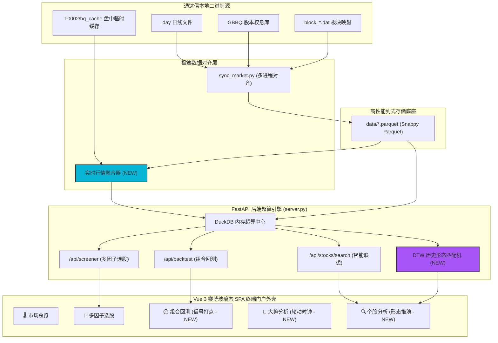

# 🚀 tdx_quant: 未来技术蓝图与系统演进规划

本规划文档梳理了 `tdx_quant` 极速单机量化系统从当前的 **Phase 11 (完美客户端排序与除权联想)** 向未来更高工业水准和实战交易终端演进的 **5 大核心技术方向**。

---

## 🗺️ 未来演进 5 大核心方向

### 1. ⏱️ 盘中实时（Near Real-Time）数据对齐与秒级极速选股雷达

当前系统完全运行在收盘后的静止 Parquet 数据池上（依靠通达信每日收盘下载的 `.day` 二进制文件）。若要将系统推向实战前线，必须具备**盘中实时监控与选股**的能力。

* **核心痛点**：收盘后数据只适合做盘后复盘，盘中瞬息万变的爆量突破和板块异动无法在第一时间捕捉。
* **技术方案**：
  * **行情监听器**：实时监听通达信客户端 `T0002/hq_cache` 目录下的实时分笔/K线临时缓存文件（如 `*.dat` 或 `*.lc5` 5分钟线）。
  * **内存瞬时缝合**：在 Python 内存中，将历史日 K 线数据（来自 Parquet 数据池）与今日盘中的实时累积行情进行 `UNION ALL` 瞬时缝合，生成包含今日实时K线的完整时序。
  * **实时风口雷达**：盘中每隔 15 秒（或按 Tick 触发）在内存中重新链算板块资金宽度和因子选股，在网页端提供实时弹窗警报（例如：*“早上 10:15，半导体板块放量共振突破个股数达 8 只，触发板块暴动信号！”*）。

> [!TIP]
> **技术优势**：该方案无需购买昂贵的商业实时 API 接口，直接“白嫖”本地通达信客户端的盘中实时接收通道，零成本实现商业级盘中雷达。

---

### 2. 📊 回测可视化下钻与个股 K 线交易信号打点 (ECharts Interactive Backtest)

当前系统的高保真组合回测引擎 (`/api/backtest`) 链算极快且指标科学，但前端目前仅展示了一条总资金净值曲线，交易员无法直观审视交易细节。

* **核心痛点**：无法直观看出策略在具体某只股票上的进出逻辑、摩擦成本和亏损来源，不便针对性调优。
* **技术方案**：
  * **交易流可视化下钻**：在网页端净值曲线上，允许用户点击任意一个交易日或调仓点，瞬间展开当天持仓列表及“买入/卖出/硬止损出局/均线破位出局”的明细流水表格。
  * **个股 K 线信号打点 (Signature Plot)**：在个股分析的 ECharts 日 K 线图上，将该策略在历史回测中对该股的所有操作以高亮图形打点标记。买入打绿色 `B` (Buy)，卖出打黄色 `S` (Sell)，风控止损打红色 `E` (Exit)。

> [!IMPORTANT]
> **实战价值**：这能让交易员一眼看出策略是否“买在了半山腰”或“卖在了最低点”，对风控参数（如追踪止盈比例、硬止损线）的微调提供极其直观的视觉反馈。

---

### 3. 📐 可视化无代码（No-Code）多因子复合策略编辑器

虽然通过直接在 `strategies.json` 中书写 DuckDB SQL 能提供近乎无限的表达自由度，但对于策略的高频试错和非程序员用户而言，编写 SQL 门槛较高。

* **核心痛点**：策略迭代依赖手写 SQL，效率较低且容易出现语法或计算错误。
* **技术方案**：
  * **拖拽式因子构建器**：在前端开发玻璃态无代码策略编辑器，将各种常用因子（如收盘价、成交量、各种周期的 MA 均线、偏离度、斜率、板块共振度等）抽象为可视化模块。
  * **智能 SQL 翻译器**：后端编写 AST 翻译器，将前端拖拽生成的条件链（例如：`[Close] > [MA20] AND [Volume] > [1.5 * Vol_MA5] AND [Resonance_Count] >= 3`）自动转译为高性能的 DuckDB 标准 SQL 语句并注入执行。

---

### 4. 🌊 板块资金“宽度波浪”时序时钟与轮动热力矩阵

系统的“行业/概念板块资金宽度”是捕捉全市场主力抱团、风口轮动的终极利器。我们需要将这种瞬时数据升维到**多维时序轮动**的高度。

* **核心痛点**：瞬时的板块宽度排名只能看出“今天谁最热”，无法洞察资金在不同板块之间的轮动、消长和潜伏轨迹。
* **技术方案**：
  * **板块轮动 2D 热力矩阵**：利用最近 30 个交易日的所有板块宽度历史数据，绘制一个横轴为时间、纵轴为板块、颜色深浅代表资金集聚度的 2D 热力矩阵，直观展示资金的流入与流出。
  * **“宽度波浪”轮动时钟（Rotation Clock）**：通过计算板块宽度的变化率（一阶导数）和加速度（二阶导数），将板块分类至“潜伏建仓期”（宽度低位悄悄爬升）、“共振爆发期”（宽度快速喷发）、“高位滞涨期”（宽度见顶钝化）和“衰退退潮期”（宽度迅速萎缩）。

> [!NOTE]
> **量化哲学**：只买在“潜伏建仓”向“共振爆发”过渡的核心节点，坚决回避进入“高位滞涨”和“衰退退潮”的板块，真正做到资金利用率的最大化。

---

### 5. 🤖 历史 K 线图形相似度匹对与未来概率推演 (DTW Pattern Matching)

基于 DuckDB 的百万级行数据超高速列式扫描能力，我们可以实现非常具有科幻色彩的“历史走势重演”推演。

* **核心痛点**：纯粹的技术指标（如金叉、死叉）过于单一，无法表达复杂的K线形态特征。
* **技术方案**：
  * **形态提取**：当用户在个股分析中打开一只股票时，系统自动提取该股最近 30 个交易日的收盘价折线形态进行归一化。
  * **DTW 极速匹对**：利用 **动态时间规整（DTW - Dynamic Time Warping）** 形态相似度匹配算法，在后台并发扫描全市场 9,000+ 标的过去 10-15 年的庞大历史 K 线库，找出与当前形态最相似的 **TOP 5 历史片段**。
  * **“未来重现”概率投影**：将这 5 个相似历史片段叠放在一起呈现在前端，并绘制它们在当年“相似形态出现后，未来 5 天、10 天、20 天的真实走势投影”，为交易员提供直观的胜率与期望推演。

---

## 📈 演进方向优先级建议与实施难度评估

为了稳步推进系统升级，以下是 5 大方向在**开发难度、计算开销、交易实战价值**维度的对比评估：

| 演进方向 | 实施难度 | 计算开销 | 实战价值 | 推荐开发优先级 |
| :--- | :---: | :---: | :---: | :---: |
| **1. 盘中实时数据同步与雷达** | ⭐⭐⭐⭐ | 🚀🚀 | 💎💎💎💎💎 | **P0 (核心突破)** |
| **2. 回测可视化下钻与K线信号打点** | ⭐⭐⭐ | 🚀 | 💎💎💎💎 | **P0 (视觉与复盘)** |
| **3. 可视化策略编辑器** | ⭐⭐⭐ | 🚀 | 💎💎 | **P2 (体验优化)** |
| **4. 板块资金轮动矩阵与时钟** | ⭐⭐ | 🚀 | 💎💎💎💎 | **P1 (大势把握)** |
| **5. 历史走势 DTW 相似度匹配** | ⭐⭐⭐⭐⭐ | 🚀🚀🚀🚀 | 💎💎💎 | **P2 (高阶探索)** |

---

## 🔮 未来系统拓扑架构扩展瞻望

