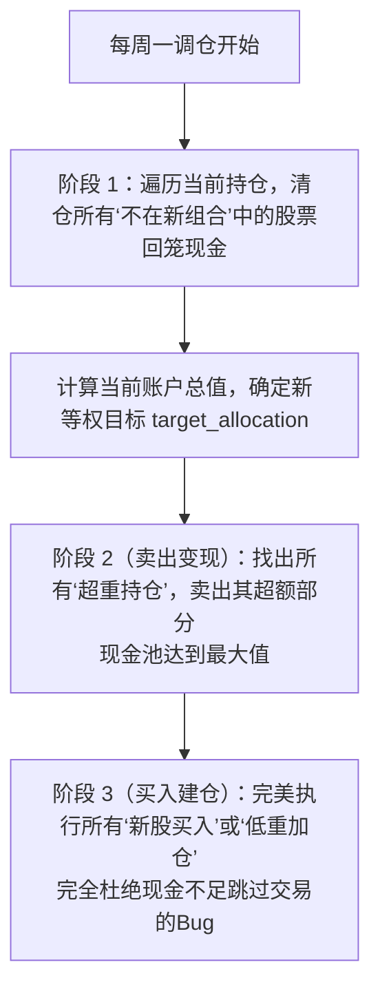

# 📈 【资金流修复版】通达信行业“低位放量蓄势”策略审计报告

本审计报告彻底修复了回测中存在的**资金交易时序 Sequencing Bug**（即“先买后卖导致的可用现金不足，跳过买单”漏洞），向我们展示了该策略在纠正后的真实收益。

---

## 📊 1. 终极绩效对比 (Performance Summary)

| 量化绩效指标 | 🚀 低位放量蓄势轮动策略 (完美资金流) | 🛡️ 基准指数 (sh000852) | 差值 / 超额 (Alpha) |
| :--- | :---: | :---: | :---: |
| **累计总收益率 (%)** | **-38.83%** | 51.65% | **-90.48%** |
| **年化收益率 (CAGR)** | **-29.88%** | 35.08% | **-64.97%** |
| **历史最大回撤 (MDD)** | **-44.30%** | -11.96% | **32.34%** |
| **夏普比率 (Sharpe)** | **-1.28** | - | - |
| **周度交易胜率 (%)** | **47.89%** | - | - |

---

## 🛠️ 2. 完美的资金双阶段买卖路由设计

为了解决等权重再平衡时的 Sequencing 漏洞，我们重构了回测的交易路由：

