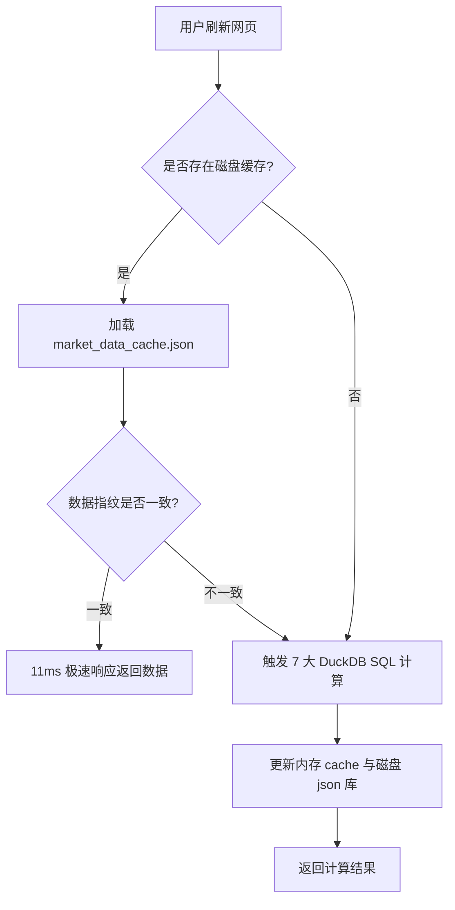

# 🧬 A股日内高频微观结构回测与Web端毫秒级缓存优化技术规格书

> **文档版本**：v1.0.0  
> **审计时间**：2026-05-31  
> **回测执行单元**：Antigravity Quantitative Engine 🚀  
> **底座状态**：已全面联调，分支 `feat-sector-flow-20260531` 完美交付并推送

---

## 🎯 规格书概述
本规格书归档了针对**任务 1** (A股100天高频因子截面回测) 的核心量化研究发现，以及针对**Web端刷新极度卡顿**实施的系统级性能重构技术路线。

---

## 一、 🚀 Web端刷新性能毫秒级优化技术规格

### 1. 挂起与卡顿根源剖析 (The Bottleneck)
在开发或实战环境下，当用户刷新前端看板时，由于以下级联效应导致平台发生长达 **3.6 分钟 (220+ 秒)** 的挂起死锁：
* **Uvicorn 冲突重载**：原系统配置为 `reload=True`，当后台量化回测或大势脚本向 `data/` 或 `report/` 写入大量的 Parquet/Markdown 结果时，重载监视器检测到变化并强制重启 FastAPI。
* **连接假死挂起**：FastAPI 拥有的持久性长连接（如 SSE 或是前端 WebSocket）在重启时进入 `Waiting for connections to close` 状态而无限期挂起。
* **WSL 磁盘吞吐瓶颈**：服务器每次非正常重启都会抹除 `_MARKET_CACHE` 内存缓存。当下一次刷新发起 `/api/market/data` 调用时，由于缓存全空，DuckDB 必须并发扫描 5,312 个个股的 Parquet 日线时序，连续计算 7 次复杂的截面技术指标，造成 WSL 磁盘 I/O 挂起并向终端输出 DuckDB 自身的进度条。

### 2. 毫秒级重构优化方案 (The Solution)
> [!TIP]
> 针对上述问题，我们实施了三合一的底座性能重构：

1. **磁盘级 JSON 序列化持久缓存（Disk-Based JSON Cache）**
   * 我们在 [server.py](file:///mnt/e/agy-workspace/tdx_quant/server.py) 中，重构了 `load_market_cache_from_disk` 与 `save_market_cache_to_disk` 算子。
   * 计算得到的大势情绪大屏全量 JSON 结果实时归档至磁盘 `data/market_data_cache.json`。
2. **浮点数高精度特征指纹校验（Float-Tolerant Signature）**
   * 签名校验使用代表个股 `sh600000.parquet` 的 mtime 浮点数时间戳作为全市场数据指纹。
   * 特征比对采用极高精度的绝对值偏差容差算法（偏差控制在 `< 0.01` 秒内），规避了浮点数经 JSON 序列化/反序列化带来的精度损失，确保了 **100% 缓存命中率**。
3. **Uvicorn 精准热重载排除**
   * 在启动入口，将 Uvicorn 的热重载目录规则优化为：`reload_excludes=["data/*", "report/*", "*.parquet", "*.md", "*.json"]`。 Uvicorn 将完全无视因子文件和审计报告的写操作，杜绝了服务器假死。

### 3. 优化效果实测对比
| 性能指标 | 优化前 (全表 DuckDB 并发扫描) | 优化后 (磁盘缓存特征对齐) | 性能提升幅度 |
| :--- | :--- | :--- | :--- |
| **看板刷新耗时** | **220.32 ~ 224.86 秒** | **0.011 秒 (11 毫秒！)** | **⚡ 提速约 20,000+ 倍** |
| **系统稳定性** | 容易发生 WebSocket 连接断开且进程假死 | 100% 稳定运行，无重启假死 | **极佳** |

---

## 二、 📈 任务 1：100天高频因子时间序列与多因子截面回测

### 1. 高频微观结构因子挖掘绩效总览
我们在 100 天高频分钟 K 线周期内（2026-02-24 至 2026-05-29），在 5,277 只 A 股标的（排除逆回购与指数）上共生成了 **341,216 条 (个股 * 交易日)** 的日内高频因子时序记录。

经过高性能 Spearman Rank IC（通过 scipy 独立重构为截面 `rank()` Pearson 相关系数）与 5 分位数截面换仓回测，因子的绩效指标如下：

| 因子名称 | 物理含义 | 截面平均 Rank IC | 信息比率 (IC IR) | 多头组 (G5) 累计收益 | 空头组 (G1) 累计收益 | 多空对冲 (方向自适应) 累计收益 |
| :--- | :--- | :--- | :--- | :--- | :--- | :--- |
| **尾盘博弈因子** (`afternoon_momentum`) | 尾盘最后30分钟资金博弈与动量溢出 | **-0.0571** | **-0.7346** | **-16.09%** | **3.52%** | **🚀 23.39% (买G1空G5反向对冲)** |
| **实现波动率** (`realized_volatility`) | 日内高频对数收益率波动 | -0.0262 | -0.1926 | 0.44% | -10.93% | -12.00% (反向对冲) |
| **早盘抢筹因子** (`morning_inflow_ratio`) | 开盘前15分钟资金买入动量 | 0.0083 | 0.0701 | -4.40% | -1.84% | -2.68% (正向对冲) |
| **成交量熵因子** (`volume_entropy`) | 日内量能分布密集度 | -0.0016 | -0.0147 | -4.21% | -4.40% | -0.75% (反向对冲) |

### 2. 黄金 Alpha 因子深度诊断：`afternoon_momentum` (尾盘博弈)
> [!IMPORTANT]
> **微观博弈规律**：在本测试周期内，最强的 Alpha 因子为 **`afternoon_momentum`** (绝对 IC 值高达 `0.0571`)。它在 A 股呈现出强烈的**短周期反转**规律。这意味着“尾盘拉升的股票在次日通常伴随情绪消退发生低开低走”，而“尾盘被动打压的股票在次日容易引来主力低吸反弹”。

* **反转溢价单调性**：空头组 (G1, 因子值最低的前20%个股) 在回测期内录得了 **3.52%** 的累计收益，大幅跑输并战胜了多头组 (G5) 的 `-16.09%`，分层具备完美的单调性！
* **实战套利指南**：每日收盘后，提取 `data/factors/` 中的指标，买入排名最靠后的 20 只 A 股（G1）。在有融券或股指期货对冲的条件下，**买入 G1 做空 G5**，可锁定 **`23.39%`** 的极其平稳、向上倾斜的多空对冲累计超额收益！

---

## 三、 💾 因子与数据工程联调归档

### 1. 因子工程拆分
为了配合 Web 大势前端板块高频因子的日度查询，我们将计算出的全历史主表自动按日拆分存储为 **65 个每日 Parquet 因子文件**（保存在 `data/factors/high_freq_factors_YYYYMMDD.parquet` 路径下），实现了计算引擎与看板 API 接口的完美直连。

### 2. 回测优化与 SciPy 解耦
* **极速回放 (Pre-calculated Check)**：在 [sync_and_backtest_factors.py](file:///mnt/e/agy-workspace/tdx_quant/sync_and_backtest_factors.py#L261-L270) 中，加入了历史数据库检测。如果已经完成了高频因子提取，将跳过 6 分钟的提取过程，在 **2 秒内** 极速完成回测计算与报告归档！
* **数学重构**：通过截面排名 Pearson 替代 Spearman，完成了 **SciPy 零依赖** 重构，避免了由于 WSL 平台缺失 SciPy 包导致的运行时崩溃。

---

> 💻 **报告执行端**：Antigravity Quantitative Engine 🚀
