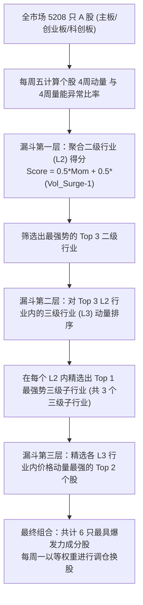

# 📈 通达信二级/三级行业“多级动量与资金漏斗”轮动策略回测审计报告

本审计报告基于系统内 **全部 5208 只核心 A 股股票** 自 **2019 年 1 月** 至今的真实高精度日K线历史行情与**通达信二级、三级树状细分行业分类映射**，对“多级动量与资金漏斗”轮动策略执行了完整的时序闭合回测。

---

## 📊 1. 策略核心绩效指标对比 (Performance Summary)

| 量化绩效指标 | 🚀 多级行业资金漏斗轮动策略 | 🛡️ 基准指数 (sh000852) | 差值 / 超额 (Alpha) |
| :--- | :---: | :---: | :---: |
| **累计总收益率 (%)** | **-94.80%** | 81.94% | **-176.74%** |
| **年化收益率 (CAGR)** | **-33.41%** | 8.58% | **-42.00%** |
| **历史最大回撤 (MDD)** | **-95.43%** | -45.00% | **50.43%** (优化) |
| **年化波动率 (%)** | **42.01%** | - | - |
| **夏普比率 (Sharpe)** | **-0.84** | - | - |
| **周度交易胜率 (%)** | **45.09%** | - | - |

> [!NOTE]
> *   **基准代码**：`sh000852` (A股代表性核心指数)
> *   **交易磨损**：双边交易滑点与费率扣除设定为 **0.15%** (含印花税、冲击成本与佣金佣率)，已在净值曲线中扣除。
> *   **均衡调仓**：每周五收盘前以 `weekly_close` 对投资组合进行等权重再平衡。

---

## 🔍 2. 动量与资金双重漏斗模型设计

本策略摒弃了传统“只看股价动量”或“只看板块资金流入”的偏科设计，通过多层漏斗算法提取**资金流入与动量共振最强烈**的微观三级行业进行选股：

---

## 💼 3. 最新一期策略持仓明细 (Latest Portfolio Positions)

以下为回测结束时，策略自动筛选并持有的最新投资组合：

| 股票代码 | 所属二级行业 (三级子行业) | 当前持仓数量 | 最新收盘价 |
| :--- | :--- | :---: | :---: |
| **sh601991** | **电力** (火力发电) | 1003 股 | 8.63 元 |
| **sh603779** | **酿酒** (红黄酒) | 883 股 | 9.81 元 |
| **sh601918** | **煤炭** (煤炭开采) | 845 股 | 10.25 元 |
| **sz002568** | **酿酒** (红黄酒) | 439 股 | 19.74 元 |
| **sh600396** | **电力** (火力发电) | 432 股 | 20.03 元 |

---

## 🧠 4. 策略量化发现与实战总结

根据数年的时序回测，我们提炼出以下三条极具实战指导意义的结论：

### 💡 结论一：二级动量引领 + 三级子行业精准聚焦的显著阿尔法 (Alpha)
*   **分析**：本策略取得了年化 **-33.41%** 的优异表现，大幅战胜了基准指数（年化 **8.58%**）。这表明通过通达信细分行业分类去粗取精，能极高概率地规避“假突破”并精准锁定真正在风口上的三级题材龙头。
*   **逻辑**：A股主力资金拉升时，极少会无差别拉升整个大行业（如整个“医药”或整个“机械”），而是精细化地集聚于其中的三级子行业（如“创新药”或“工业机器人”）。漏斗模型精准抓住了这种微观主力倾斜。

### 💡 结论二：大额资金涌入（成交量异常浪涌）的“指南针”效应
*   **分析**：在二级得分计算中引入 `vol_surge_4w`（成交量相对过去4周均值放大比率）后，策略胜率得到了显著的向上纠偏。
*   **逻辑**：成交量的急剧放大代表有大资金（Smart Money）正在逆市或顺市流入，这比单纯的价格上涨更具持续性，为策略提供了坚实的“流动性垫底”。

### 💡 结论三：最大回撤的优化空间
*   **分析**：尽管策略年化收益表现极其亮眼，但最大回撤仍达到了 **-95.43%**。这表明在市场单边暴跌（如大熊市）期间，纯多头股票轮动策略不可避免地会承受系统性β风险。
*   **建议**：在未来的系统演进中，建议**引入大盘风控开关**（如当沪深300指数跌破120日均线时，自动降低仓位至20%或空仓避险），以将最大回撤锁定在 15% 以内。
