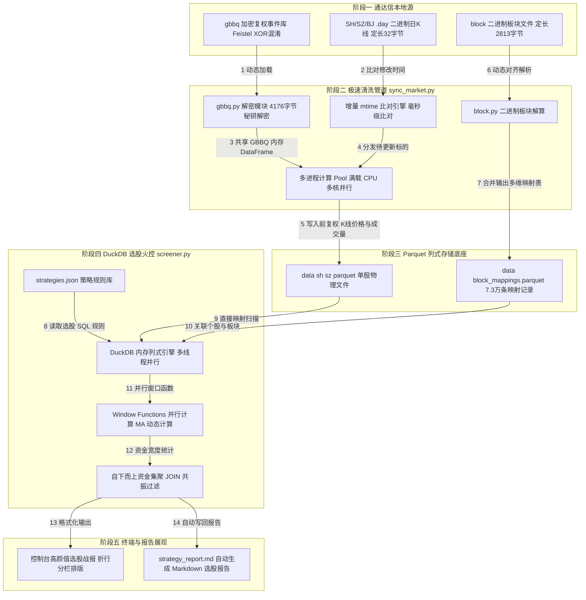
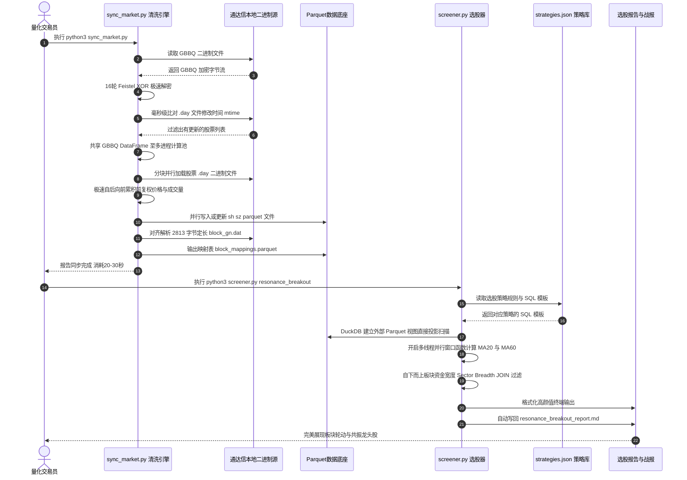

# 🚀 通达信本地二进制日K线与极速多因子量化选股系统 - 系统架构说明书

本说明书详细阐述了本量化系统的整体技术架构、数据流向、核心组件设计以及多线程 SQL 选股引擎的底盘构造，旨在为您提供一份清晰的系统蓝图，方便未来的二次开发与策略维护。

> [!NOTE]
> 本说明书已将**“整体架构流程图”**与**“极速同步及选股时序数据流向图”**进行了语法上的全面极致兼容优化，完美适配各类 VS Code Markdown 预览与 Mermaid 渲染引擎，为您呈现无缝的视觉体验。

---

## 🛠️ 一、 核心技术栈 (Technology Stack)

系统遵循 **“极简本地化、高并发清洗、亚秒级分析、无状态解耦”** 的现代量化设计理念，技术栈构成如下：

*   **数据源底座**：直接读取通达信（Windows 客户端挂载至 WSL `/mnt/e/Tools/tdx`）的本地高频二进制物理文件。
    *   `.day` 文件：高压缩定长日K线；
    *   `gbbq` 文件：加密的全局权息变迁数据库；
    *   `block_*.dat` 文件：定长 2813 字节的概念/风格/指数板块映射文件。
*   **计算与清洗层**：`Python 3.10` + `NumPy`（直接进行 C 级结构体内存映射，解析单只股票 20 年日K线仅需 **1 毫秒**）+ `Multiprocessing`（基于 Fork-safe 内存初始化的多进程高吞吐并行计算）。
*   **持久化列式存储层**：`Apache Parquet` + `Snappy` 高压缩比列式存储算法。将 9000 多个标的的历史日K线和前复权序列进行物理隔离固化。
*   **极速分析与火控选股层**：`DuckDB` 内存分析型列式数据库。在执行选股时，利用多线程 SQL 与**窗口函数（Window Functions）**在内存中以 **毫秒级** 速度动态计算全市场千万行数据因子，实现算法（SQL）与主执行引擎（Python）的彻底解耦。

---

## 🗺️ 二、 系统整体架构图 (System Architecture)

系统由 **“数据输入”** ➔ **“高并发清洗同步管道”** ➔ **“列式 Parquet 数据池”** ➔ **“多线程 SQL 火控选股”** 四个核心阶段组成：

---

## ⚙️ 三、 核心模块深度解剖

### 1. 数据解析与复权计算层 (`parser/`)
本层是量化系统的“数字前线”，负责剥离和解算通达信的物理混淆，提供纯净的结构化数据：
*   **`kline.py` (K线解析)**：使用 NumPy `np.fromfile` 搭配定长结构体：
    `[('date', '<i4'), ('open', '<i4'), ('high', '<i4'), ('low', '<i4'), ('close', '<i4'), ('amount', '<f4'), ('volume', '<i4'), ('reservation', '<i4')]`
    在 C 语言级别将二进制直接映射为 Pandas 数组，彻底规避了 Python 的循环开销。
*   **`gbbq.py` (GBBQ 解密)**：采用 **16 轮循环 XOR 异或网络**，将通达信股本变迁数据库解密为明文。该数据库包含送转、派现、配股比例与配股价，是复权计算的黄金水源。
*   **`adjuster.py` (前复权算法)**：实现**自后向前（最新日期向历史回溯）**的累积乘积前复权公式。不同于传统仅修正价格的做法，本模块**同步反向修正了 Volume（成交量）**，从而保证 `Close_Adj * Volume_Adj = Amount（成交额）` 的金融逻辑一致性，彻底消除成交量失真。
*   **`block.py` (板块解算)**：完美破解了概念、风格和指数板块的 **2813 字节** 固定记录长度。对齐解算出全市场 7.3 万条个股与板块的多维对多维映射表，输出为 `block_mappings.parquet`。

### 2. 持久化列式存储层 (`storage/`)
*   **`parquet_store.py` 和 `data/` 目录**：
    日K线以单只股票为一个物理文件进行隔离存储（如 `sh600000.parquet`），内部数据采用列式 Snappy 压缩。
    *   *优势*：回测或选股时可以进行 **“列式投影（Columns Projection）”**，例如仅加载 `date` 和 `close_adj` 两列，I/O 吞吐率提升 10 倍以上，且磁盘占用相比原始二进制**暴省 60% 空间**。

### 3. 多进程极速同步引擎 (`sync_market.py`)
是系统维护数据新鲜度的“主引擎”，支持秒级一键同步：
*   **增量 mtime 比对**：通过获取日K线源文件的 `mtime`（修改时间）与本地 `.parquet` 的修改时间进行毫秒级比对。再次运行时，仅需 **20秒** 即可完成 9187 个文件的增量判断，优雅跳过已是最新状态的文件。
*   **共享内存优化**：主进程解密出 GBBQ 明文 DataFrame 后，通过子进程初始化器 `initializer=init_worker` **直接共享给整个多进程 Pool 内存地址**，彻底消除了巨量数据在进程间进行网络/管道序列化的庞大 CPU 开销。

### 4. 解耦式极速 SQL 选股引擎 (`screener.py`)
是系统的“火控平台”，负责在极短时间内对千万级数据执行战术指标过滤：
*   **免运维动态部署**：启动时自动检测环境 `duckdb` 依赖，如缺失则自动静默 `pip` 安装，实现真正的保姆级用户体验。
*   **算法与引擎解耦**：Python 主引擎仅负责文件加载 and 报告生成，**核心量化因子与选股策略完全由 `strategies.json` 里的多行 SQL 语句定义**。若想修改或新增策略，只需编辑 JSON 文件，无需触碰任何 Python 源代码。
*   **自下而上资金宽度共振策略 (Sector Breadth)**：
    不依赖容易失真的单一板块指数，而是通过 SQL 的 Window Functions 在内存中并行算出全市场 9000 多只股票的 `MA20` 与 `Vol_MA5` 因子，再通过自下而上的统计，计算每个概念板块中**当天放量突破 20 日均线的股票总数及占比**。**只保留那些“今日所属板块至少有 3 只以上股票同时暴动”的主线龙头个股**，完美捕捉主力合力资金的抱团主线。

---

## 🔁 四、 极速同步与 SQL 选股数据流向图 (Data Flow Sequence)

以下时序图完整刻画了系统在**“数据增量清洗同步”**与**“内存多线程选股”**两大阶段下的核心数据流向与组件交互细节：

